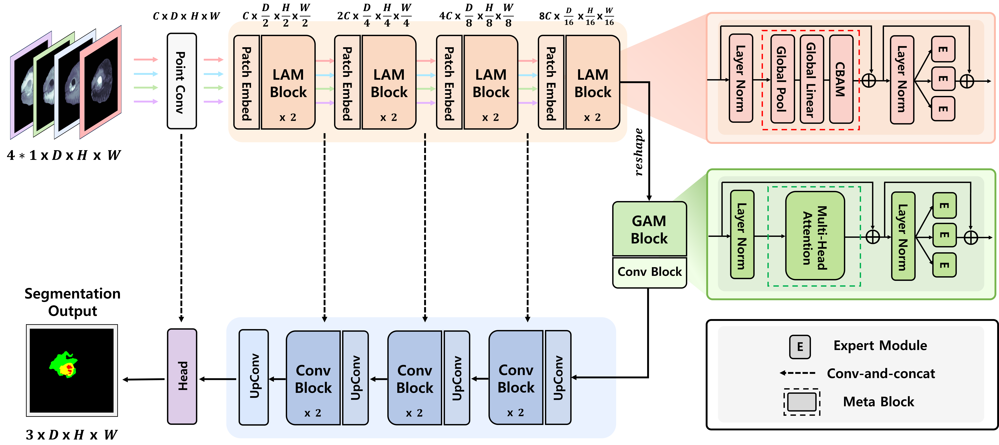

# AMoE-BTS

> **Adaptive Mixture of Experts for Personalized Modality Importance in Brain Tumor Segmentation(2024)** 
> [Jeongeun Kim],[Youngwan Jo], [Sunghyun Ahn], and [Sanghyun Park] 

## Overview

    

we propose an Adaptive Mixture of Experts (MoE) for Brain Tumor Segmentation (AMoE-BTS) model, which comprises the Local Adaptive MoE (LAM) and Global Adaptive MoE (GAM) blocks. The LAM block dynamically extracts modality-specific information. The GAM block then captures the complex interactions between different modali ties to improve segmentation performance. The experimental results obtained on the BraTS2019 and BraTS2020 datasets demonstrate that AMoE-BTS achieves superior performance across the WT, TC, and ET regions with high Dice scores and HD95 values. By effectively combining the key information provided by each modality, AMoE-BTS precisely delineates tumor boundaries, delivering improved segmentation accuracy and outperforming state-of-the-art models
